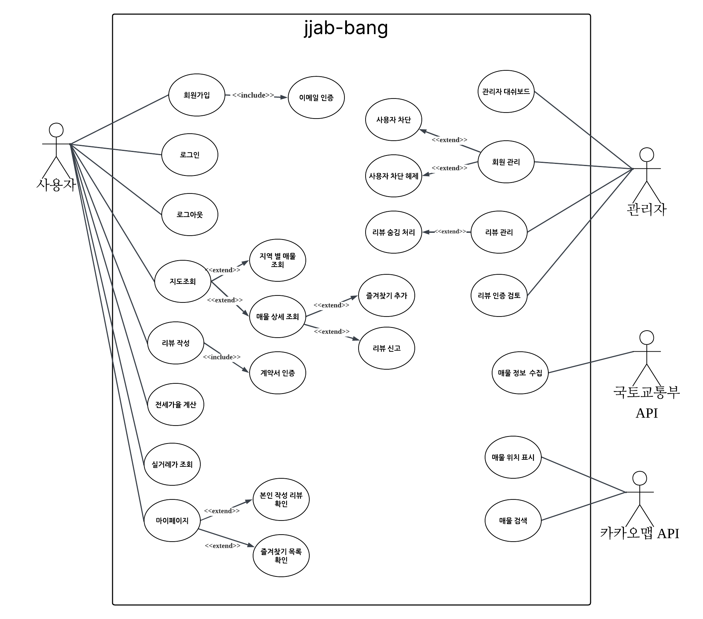
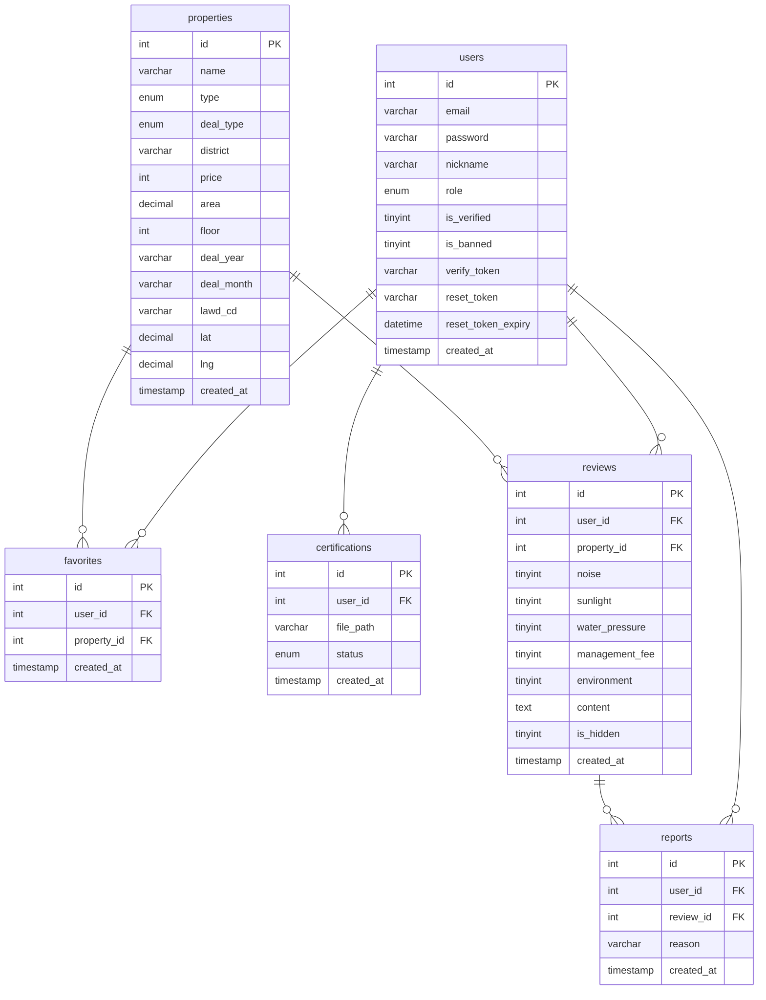
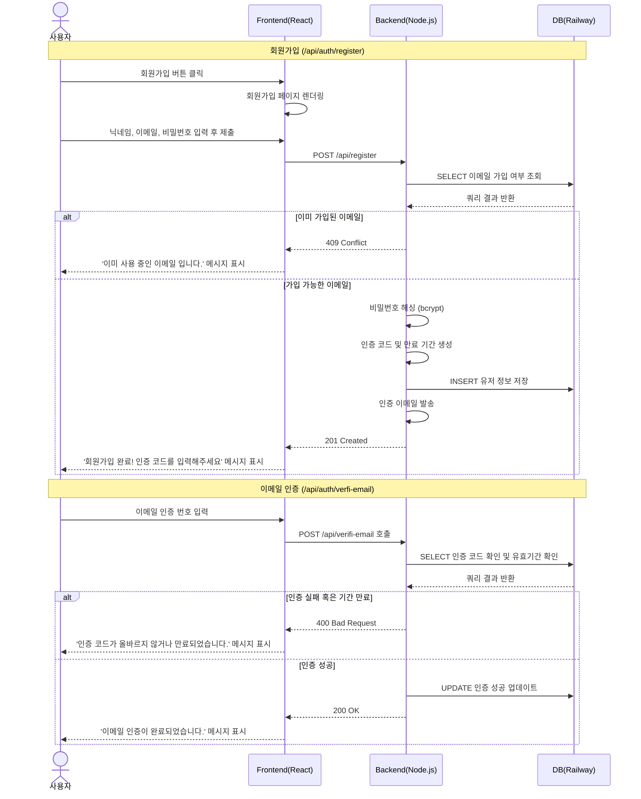
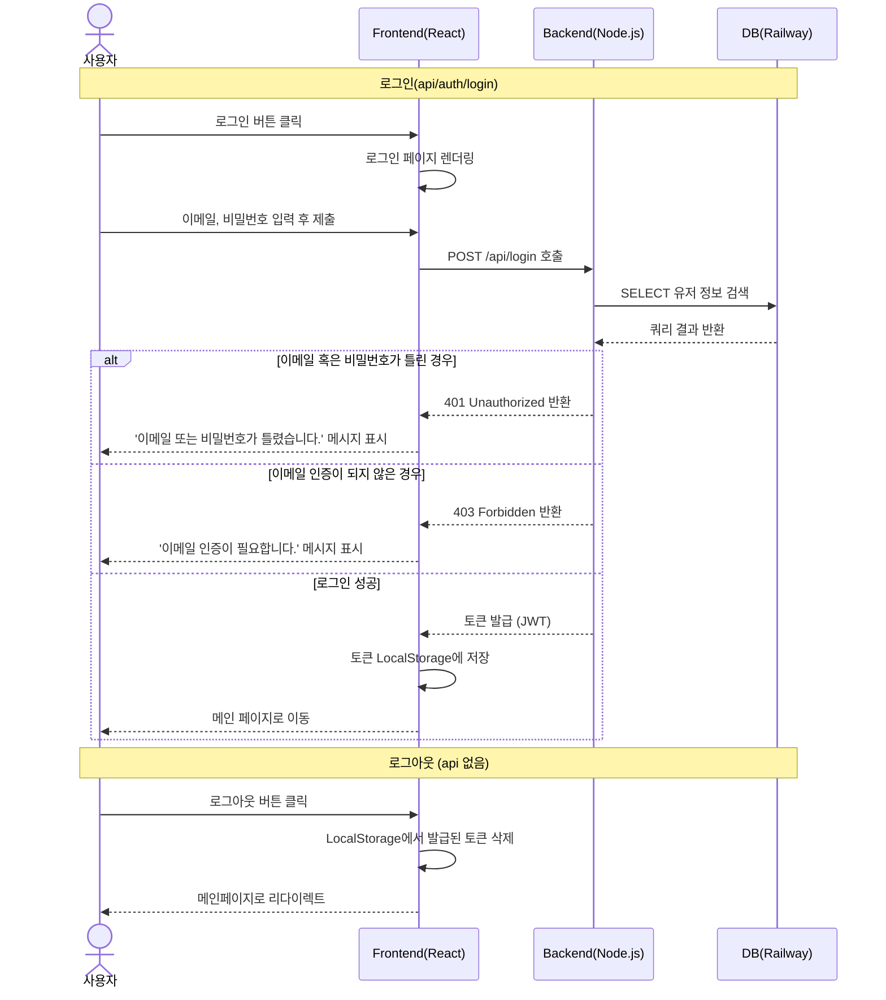
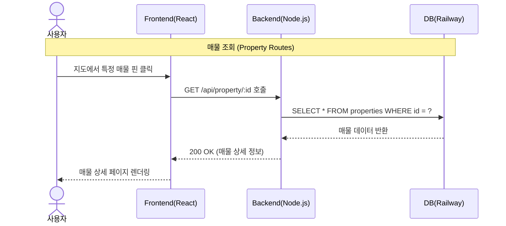
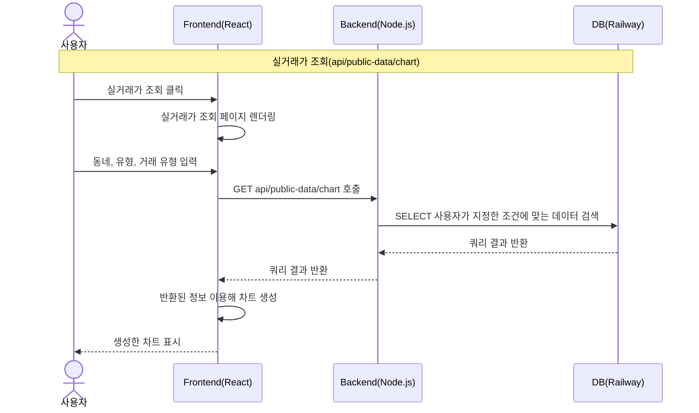
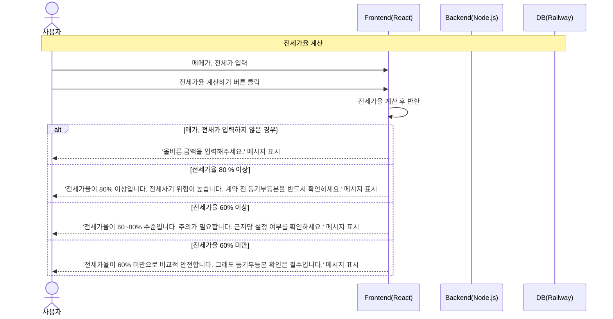
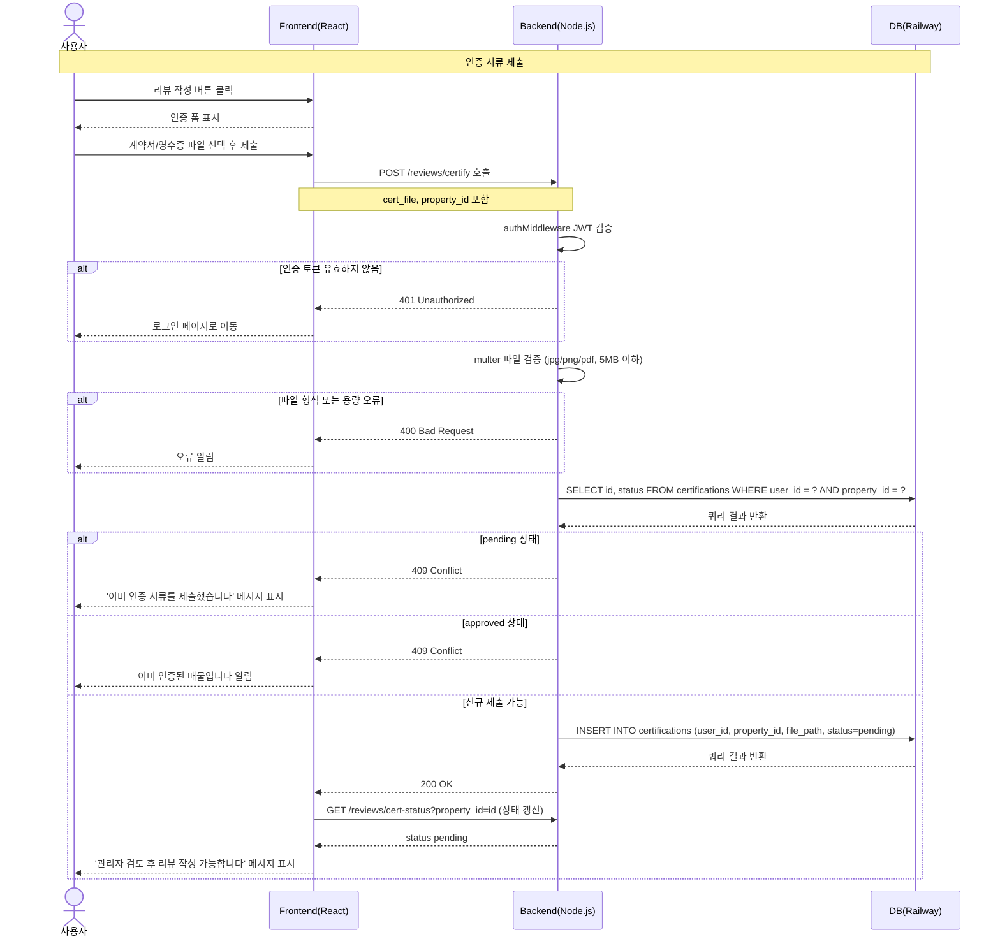
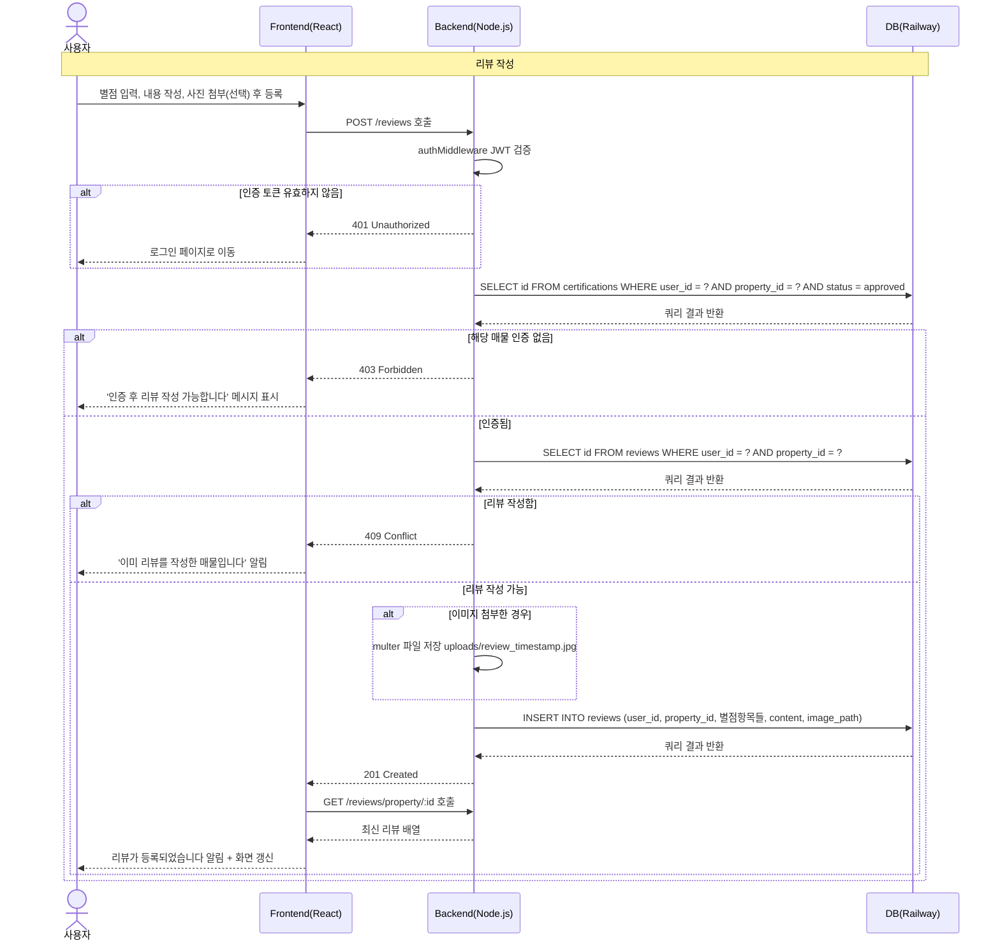
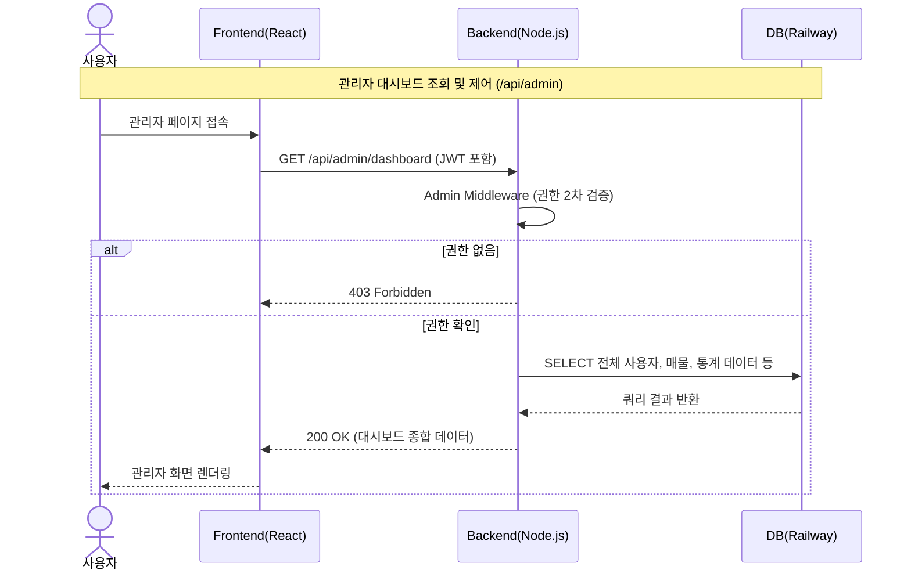

# 짭방 (Jjab-bang) 최종 프로젝트 보고서

> 대학가 자취방 안심 정보 공유 플랫폼

---

## 1. 프로젝트 개요

### 1.1 프로젝트 소개

**짭방**은 대학생이 자취방을 구할 때 필요한 정보를 한 곳에서 확인할 수 있는 웹 플랫폼입니다. 국토교통부 공공데이터 기반의 실거래가 정보, 실거주자의 익명 리뷰, 전세사기 예방 기능을 통합하여 대학생이 안전하게 자취방을 선택할 수 있도록 지원합니다.

### 1.2 개발 배경

- 대학생의 자취방 정보 비대칭 문제 (부동산 앱은 정보 제한, 수수료 부담)
- 전세사기 피해 증가로 인한 안전 정보 필요성
- 실거주자의 솔직한 후기 부재

### 1.3 팀 구성

| 이름 | 역할 |
|------|------|
| 안효진 | 팀장 / 백엔드|
| 손현영 | 팀원 / 프론트|
| 최현우 | 팀원 / 프론트|
| 김동민 | 팀원 / 백엔드|

### 1.4 유스케이스


---

## 2. 기술 스택

### 2.1 프론트엔드

| 기술 | 용도 |
|------|------|
| React + Vite | SPA 프레임워크 |
| React Router | 클라이언트 사이드 라우팅 |
| Axios | HTTP 통신 |
| Chart.js | 실거래가 차트 시각화 |
| Kakao Map API | 지도 및 매물 핀 표시 |

### 2.2 백엔드

| 기술 | 용도 |
|------|------|
| Node.js + Express | REST API 서버 |
| MySQL | 데이터베이스 |
| JWT | 사용자 인증 |
| Multer | 파일 업로드 |
| bcrypt | 비밀번호 암호화 |
| SendGrid | 이메일 인증 |

### 2.3 인프라 및 외부 API

| 기술 | 용도 |
|------|------|
| Railway | 백엔드 서버 + MySQL DB 호스팅 |
| Vercel | 프론트엔드 배포 |
| 국토교통부 OpenAPI | 실거래가 데이터 수집 |
| 카카오 지도 API | 지도 표시 |
| 카카오 주소 검색 API | 건물 좌표 변환 |

---

## 3. 시스템 아키텍처

```
[Client - React]
      |
      | REST API
      v
[Server - Node.js/Express]
      |
      |--- MySQL (Railway)
      |--- SendGrid (이메일)
      |--- 국토교통부 API (데이터 수집)
      |--- 카카오 API (지도/좌표)
```

### 3.1 데이터베이스 구조

| 테이블 | 설명 |
|--------|------|
| users | 회원 정보 (이메일, 비밀번호, 닉네임, 역할, 정지 여부) |
| properties | 매물 정보 (건물명, 유형, 거래유형, 가격, 좌표) |
| reviews | 거주자 리뷰 (소음, 채광, 수압, 관리비, 환경, 이미지) |
| certifications | 계약서 인증 (유저-매물 단위 인증) |
| favorites | 즐겨찾기 |
| reports | 리뷰 신고 |

### 3.2 데이터베이스 erd


---

## 4. 주요 기능

### 4.1 회원 관리

- 이메일 회원가입 + SendGrid 인증 메일 발송
- JWT 기반 로그인/로그아웃
- 관리자(admin) / 일반 유저(user) 역할 구분

### 4.2 실거래가 차트

- 국토교통부 공공데이터 포털 API 4종 연동
  - 오피스텔 전세/월세, 오피스텔 매매
  - 연립다세대 전세/월세, 연립다세대 매매
- 수집 지역: 서울 중구(11140), 경북 경주시(47130)
- 수집 기간: 2024년 1월 ~ 2026년 5월
- 총 약 9,000건 데이터 수집 후 DB 저장
- 동네 / 유형 / 거래 유형 필터로 월별 평균 보증금 추이 Chart.js로 시각화

### 4.3 카카오맵 매물 지도

- 중구 / 경주시 지역 탭 필터
- 건물 유형(오피스텔/연립다세대), 거래 유형(매매/전세·월세) 필터
- 건물명 검색
- 핀 클릭 시 매물 정보 팝업 → 상세 페이지 연결
- 카카오 주소 검색 API로 건물별 정확한 좌표 DB 저장 (범위 검증 포함)

### 4.4 매물 상세 / 거주자 리뷰

- 매물 정보(건물명, 지역, 유형, 가격, 층수, 면적) 표시
- 즐겨찾기 추가/제거
- **계약서 인증 시스템**
  - 해당 매물의 계약서 또는 영수증 업로드
  - 관리자 승인 후 해당 매물에 한해 리뷰 작성 가능 (매물별 인증 분리)
- 리뷰 항목: 소음, 채광, 수압, 관리비, 환경 (5점 척도)
- 리뷰 사진 첨부 기능
- 5회 이상 신고 시 자동 숨김 처리

### 4.5 전세가율 계산기

- 매매가 / 전세가 입력 → 전세가율(%) 자동 계산
- 3단계 위험도 판정
  - 60% 미만: 안전 (초록)
  - 60~80%: 주의 (노랑)
  - 80% 이상: 위험 (빨강)
- 게이지바 시각화
- 전세사기 예방 체크리스트 6항목 제공
- 대법원 인터넷등기소 링크 연결

### 4.6 관리자 페이지

- 대시보드: 전체 회원 수, 매물 수, 대기 인증 건수, 신고 건수
- 인증 검토: 계약서 파일 열람 후 승인/거절
- 신고 처리: 신고된 리뷰 확인 및 숨김 처리
- 회원 관리: 회원 목록 조회, 정지/해제

### 4.7 마이페이지

- 즐겨찾기 목록 조회 및 삭제
- 내가 작성한 리뷰 목록 및 삭제

### 4.8 시퀀스 다이어그램
#### 4.8.1 회원가입 및 인증


### 4.8.2 로그인/로그아웃


#### 4.8.3 상세 매물 조회


#### 4.8.4 실거래가 조회


#### 4.8.5 전세가율 계산


#### 4.8.6 리뷰 등록 및 인증
- 인증

- 리뷰 등록


#### 4.8.7 관리자 대시보드 

---

## 5. API 설계

### 5.1 인증 API

| Method | Endpoint | 설명 |
|--------|----------|------|
| POST | /api/auth/register | 회원가입 |
| POST | /api/auth/login | 로그인 |
| POST | /api/auth/verify-email | 이메일 인증 |

### 5.2 매물 API

| Method | Endpoint | 설명 |
|--------|----------|------|
| GET | /api/properties | 매물 목록 (필터: type, deal_type, lawd_cd, name) |
| GET | /api/properties/:id | 매물 상세 |

### 5.3 리뷰 API

| Method | Endpoint | 설명 |
|--------|----------|------|
| GET | /api/reviews/cert-status | 인증 상태 확인 (매물별) |
| POST | /api/reviews/certify | 계약서 업로드 |
| GET | /api/reviews/property/:id | 매물 리뷰 목록 |
| POST | /api/reviews | 리뷰 작성 |
| DELETE | /api/reviews/:id | 리뷰 삭제 |
| POST | /api/reviews/:id/report | 리뷰 신고 |
| GET | /api/reviews/my | 내 리뷰 목록 |

### 5.4 즐겨찾기 API

| Method | Endpoint | 설명 |
|--------|----------|------|
| GET | /api/favorites | 즐겨찾기 목록 |
| POST | /api/favorites/:id | 즐겨찾기 추가 |
| DELETE | /api/favorites/:id | 즐겨찾기 삭제 |
| GET | /api/favorites/check/:id | 즐겨찾기 여부 확인 |

### 5.5 공공데이터 API

| Method | Endpoint | 설명 |
|--------|----------|------|
| POST | /api/public-data/fetch | 국토교통부 데이터 수집 |
| GET | /api/public-data/chart | 차트 데이터 조회 |

### 5.6 관리자 API

| Method | Endpoint | 설명 |
|--------|----------|------|
| GET | /api/admin/dashboard | 대시보드 통계 |
| GET | /api/admin/certifications | 인증 목록 |
| PATCH | /api/admin/certifications/:id | 인증 승인/거절 |
| GET | /api/admin/reports | 신고 목록 |
| PATCH | /api/admin/reviews/:id/hide | 리뷰 숨김 |
| GET | /api/admin/users | 회원 목록 |
| PATCH | /api/admin/users/:id/ban | 회원 정지 |
| PATCH | /api/admin/users/:id/unban | 회원 정지 해제 |

---

## 6. 테스트

### 6.1 테스트 개요

| 구분 | 테스트 케이스 수 | 결과 |
|------|----------------|------|
| 블랙박스 | 32개 | 전체 PASS |
| 화이트박스 | 32개 | 전체 PASS |
| **합계** | **64개** | **100% PASS** |

### 6.2 테스트 대상 기능

1. 회원가입 / 이메일 인증
2. 로그인 / 로그아웃
3. 매물 조회 / 검색
4. 즐겨찾기
5. 계약서 인증 / 리뷰 작성
6. 리뷰 신고
7. 전세가율 계산기
8. 관리자 기능

### 6.3 테스트 시나리오

#### 6.3.1 블랙박스 테스트

| TC ID | 테스트 항목 | 입력값 | 예상 결과 | 결과 |
|-------|------------|--------|-----------|------|
| BB-01 | 정상 회원가입 | 이메일/비밀번호/닉네임 유효 | 201 Created, 인증 이메일 발송 | PASS |
| BB-02 | 중복 이메일 | 기존 가입 이메일 재입력 | 400 Bad Request | PASS |
| BB-03 | 이메일 인증 성공 | 6자리 코드 정확히 입력 | 200 OK, is_verified=1 | PASS |
| BB-04 | 만료된 인증 코드 | 10분 후 코드 입력 | 400 Bad Request | PASS |
| BB-05 | 정상 로그인 | 가입된 이메일 + 올바른 비밀번호 | 200 OK + JWT 토큰 반환 | PASS |
| BB-06 | 비밀번호 틀림 | 올바른 이메일 + 틀린 비밀번호 | 401 Unauthorized | PASS |
| BB-07 | 미인증 계정 로그인 | is_verified=0 계정 | 403 Forbidden | PASS |
| BB-08 | 정지된 계정 | is_banned=1 계정 | 403 Forbidden | PASS |
| BB-09 | 전체 매물 조회 | 파라미터 없음 | 200 OK + 전체 매물 배열 | PASS |
| BB-10 | 유형 필터 | type=오피스텔 | 200 OK + 오피스텔만 반환 | PASS |
| BB-11 | 지역 필터 | lawd_cd=11140 | 200 OK + 중구 매물만 반환 | PASS |
| BB-12 | 건물명 검색 | name=지웰 | 200 OK + 지웰 포함 매물 | PASS |
| BB-13 | 즐겨찾기 추가 | 로그인 상태 + propertyId | 200 OK + favorites 삽입 | PASS |
| BB-14 | 즐겨찾기 삭제 | 기존 즐겨찾기 DELETE | 200 OK + 레코드 삭제 | PASS |
| BB-15 | 즐겨찾기 여부 확인 | GET /favorites/check/:id | 200 OK + { isFavorite: true/false } | PASS |
| BB-16 | 비로그인 즐겨찾기 | JWT 토큰 없이 요청 | 401 Unauthorized | PASS |
| BB-17 | 계약서 정상 업로드 | jpg/png/pdf + property_id | 201 Created, pending 상태 저장 | PASS |
| BB-18 | 미승인 상태 리뷰 | certStatus=pending | 403 Forbidden | PASS |
| BB-19 | 정상 리뷰 작성 | approved 상태 + 리뷰 내용 | 201 Created | PASS |
| BB-20 | 다른 매물 리뷰 시도 | A매물 승인 후 B매물 리뷰 | 403 Forbidden | PASS |
| BB-21 | 정상 신고 접수 | 로그인 + 신고 사유 | 200 OK | PASS |
| BB-22 | 5회 누적 자동 숨김 | 동일 리뷰 5번째 신고 | is_hidden=1 자동 업데이트 | PASS |
| BB-23 | 비로그인 신고 | JWT 없이 신고 | 401 Unauthorized | PASS |
| BB-24 | 숨겨진 리뷰 미노출 | GET /reviews/property/:id | is_hidden=0 리뷰만 반환 | PASS |
| BB-25 | 안전 구간 (50%) | 매매 50000 / 전세 25000 | 50.0% — 안전 | PASS |
| BB-26 | 주의 구간 (70%) | 매매 50000 / 전세 35000 | 70.0% — 주의 | PASS |
| BB-27 | 위험 구간 (90%) | 매매 50000 / 전세 45000 | 90.0% — 위험 | PASS |
| BB-28 | 매매가 0 입력 | 매매가 0 | 오류 알림 표시 | PASS |
| BB-29 | 인증 서류 승인 | PATCH certifications/:id approved | status=approved 업데이트 | PASS |
| BB-30 | 리뷰 숨김 처리 | PATCH reviews/:id/hide | is_hidden=1 업데이트 | PASS |
| BB-31 | 회원 정지 | PATCH users/:id/ban | is_banned=1 업데이트 | PASS |
| BB-32 | 일반 유저 관리자 접근 | role=user로 /admin 접근 | 403 Forbidden | PASS |

#### 6.3.2 화이트박스 테스트

| TC ID | 테스트 항목 | 검증 경로/조건 | 예상 결과 | 결과 |
|-------|------------|---------------|-----------|------|
| WB-01 | 이메일 중복 분기 | SELECT COUNT(*) > 0 → true | 400 분기 진입, 오류 반환 | PASS |
| WB-02 | 중복 없음 분기 | SELECT COUNT(*) = 0 → false | bcrypt.hash() → INSERT 실행 | PASS |
| WB-03 | 인증코드 만료 조건 | expires_at < NOW() | 400 만료 분기 진입 | PASS |
| WB-04 | 인증코드 일치 조건 | code === stored_code | UPDATE is_verified=1 실행 | PASS |
| WB-05 | 이메일 없음 분기 | rows.length === 0 → true | 401 분기 진입 | PASS |
| WB-06 | bcrypt 비교 분기 | bcrypt.compare() → false | 401 분기 진입 | PASS |
| WB-07 | is_verified 분기 | user.is_verified === 0 | 403 분기 진입 | PASS |
| WB-08 | JWT 발급 경로 | 모든 조건 통과 시 jwt.sign() | JWT 토큰 정상 반환 | PASS |
| WB-09 | type 조건 분기 | if(type) → true | WHERE type=? 쿼리 추가 | PASS |
| WB-10 | lawd_cd 조건 분기 | if(lawd_cd) → true | WHERE lawd_cd=? 쿼리 추가 | PASS |
| WB-11 | name LIKE 분기 | if(name) → true | WHERE name LIKE '%?%' 추가 | PASS |
| WB-12 | 파라미터 없음 분기 | 모든 조건 false | WHERE 1=1만 실행, 전체 반환 | PASS |
| WB-13 | authMiddleware 통과 | 유효한 JWT → req.user 설정 | next() 호출 | PASS |
| WB-14 | authMiddleware 실패 | 토큰 없음 / 만료 | 401 분기 진입 | PASS |
| WB-15 | 즐겨찾기 존재 분기 | exist.length > 0 → true | DELETE 실행 (토글 제거) | PASS |
| WB-16 | 즐겨찾기 없음 분기 | exist.length === 0 → false | INSERT 실행 (토글 추가) | PASS |
| WB-17 | 파일 없음 분기 | req.file === null | 400 분기 진입 | PASS |
| WB-18 | property_id 없음 | !property_id | 400 분기 진입 | PASS |
| WB-19 | 인증 승인 확인 분기 | cert.length === 0 (approved 없음) | 403 분기 진입 | PASS |
| WB-20 | 리뷰 중복 분기 | dup.length > 0 | 409 분기 진입 | PASS |
| WB-21 | COUNT 5 미만 분기 | count[0].cnt < 5 | UPDATE 미실행 | PASS |
| WB-22 | COUNT 5 이상 분기 | count[0].cnt >= 5 | UPDATE is_hidden=1 실행 | PASS |
| WB-23 | 리뷰 목록 hidden 필터 | WHERE is_hidden=0 | 숨김 리뷰 제외 확인 | PASS |
| WB-24 | DB 오류 처리 | pool.query() throw Error | 500 Internal Server Error catch 진입 | PASS |
| WB-25 | 입력값 유효성 분기 | !sale \|\| !jeonse \|\| sale<=0 | alert() 호출 후 return | PASS |
| WB-26 | rate >= 80 분기 | jeonse/sale*100 >= 80 | risk='위험', color='#dc2626' | PASS |
| WB-27 | rate >= 60 분기 | 60 <= jeonse/sale*100 < 80 | risk='주의', color='#d97706' | PASS |
| WB-28 | rate < 60 분기 | jeonse/sale*100 < 60 | risk='안전', color='#16a34a' | PASS |
| WB-29 | adminMiddleware 통과 | req.user.role === 'admin' | next() 호출 | PASS |
| WB-30 | adminMiddleware 차단 | req.user.role !== 'admin' | 403 분기 진입 | PASS |
| WB-31 | 인증 상태 업데이트 | UPDATE certifications SET status=? | approved/rejected 분기 | PASS |
| WB-32 | 회원 정지 쿼리 | UPDATE users SET is_banned=1 | 해당 유저 ID 업데이트 | PASS |

---

## 7. 트러블슈팅

### 7.1 계약서 인증 버그

- **문제**: 한 매물 인증 시 모든 매물 리뷰 작성 가능
- **원인**: `certifications` 테이블에 `property_id` 없이 유저 단위로만 인증 확인
- **해결**: `property_id` 컬럼 추가, 인증/리뷰 작성 시 매물별로 분리 검증

### 7.2 맵핀 타지역 오류

- **문제**: 경주시 핀이 인천, 대전 등 타지역에 표시
- **원인**: 카카오 API 검색 시 지역 특정이 불충분해 동명이 지역 좌표 반환
- **해결**: lawd_cd 기반 지역 구분 + 좌표 범위 검증 로직 추가

### 7.3 인증 상태 확인 라우트 충돌

- **문제**: `/reviews/cert-status` 가 `/:id` 패턴에 잡혀 404 반환
- **원인**: Express 라우트 순서 문제 (`/:id` 먼저 등록)
- **해결**: `cert-status`, `my` 등 고정 경로를 `/:id` 보다 앞에 등록

### 7.4 SendGrid API 키 만료

- **문제**: 이메일 인증 메일 미발송
- **원인**: SendGrid API 키 만료
- **해결**: 새 API 키 발급 및 환경 변수 업데이트

---

## 8. 데이터 수집 결과

| 항목 | 내용 |
|------|------|
| 수집 지역 | 서울 중구, 경북 경주시 |
| 수집 기간 | 2024년 1월 ~ 2026년 5월 |
| 총 매물 수 | 약 9,000건 |
| 건물 좌표 | 카카오 주소 검색 API로 건물별 저장 |
| API 종류 | 오피스텔 전세/월세, 오피스텔 매매, 연립다세대 전세/월세, 연립다세대 매매 |

---

## 9. 향후 개선 사항

- 배포 완료 (Railway + Vercel)
- 수집 지역 확대 (전국 대학가)
- PWA 푸시 알림 기능
- 매물 가격 알림 기능
- 지도 클러스터링 (핀 밀집 시 그룹화)

---

## 10. 결론

짭방은 대학생의 자취방 정보 비대칭 문제를 해결하기 위해 공공데이터, 지도 API, 익명 리뷰 시스템을 통합한 플랫폼입니다. 계약서 기반 인증 시스템으로 리뷰의 신뢰성을 확보하고, 전세가율 계산기로 전세사기 예방 정보를 제공합니다. 약 9,000건의 실거래가 데이터를 기반으로 실질적인 시세 파악이 가능하며, 향후 지역 확장을 통해 더 많은 대학생에게 도움이 될 수 있을 것으로 기대합니다.

---

*2조 | 안효진 · 손현영 · 최현우 · 김동민*
