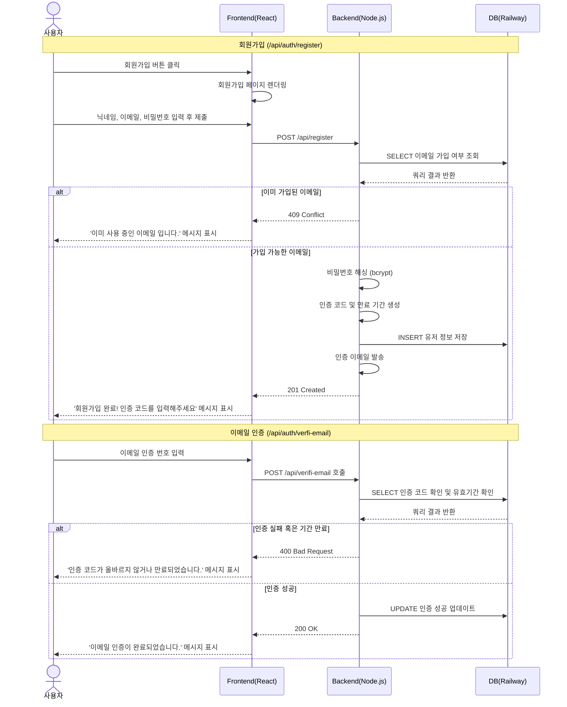
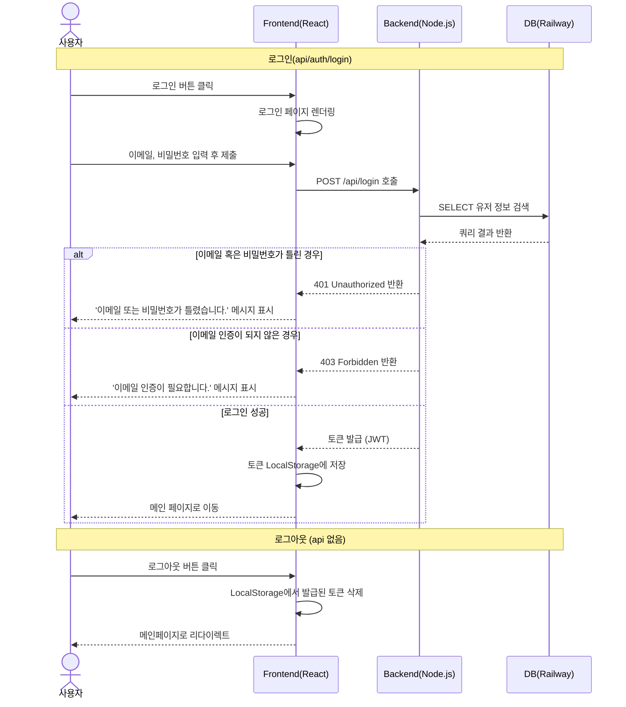
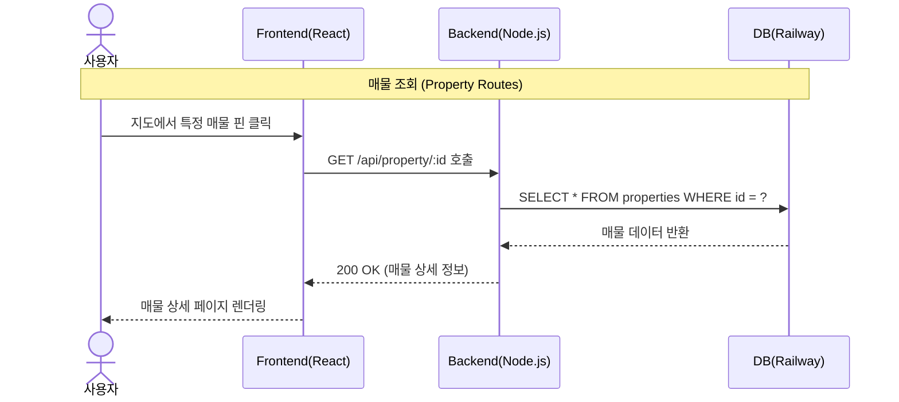
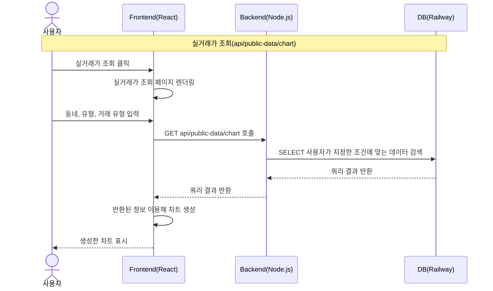
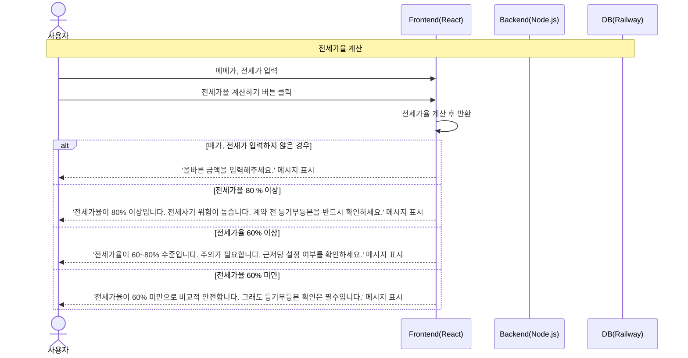
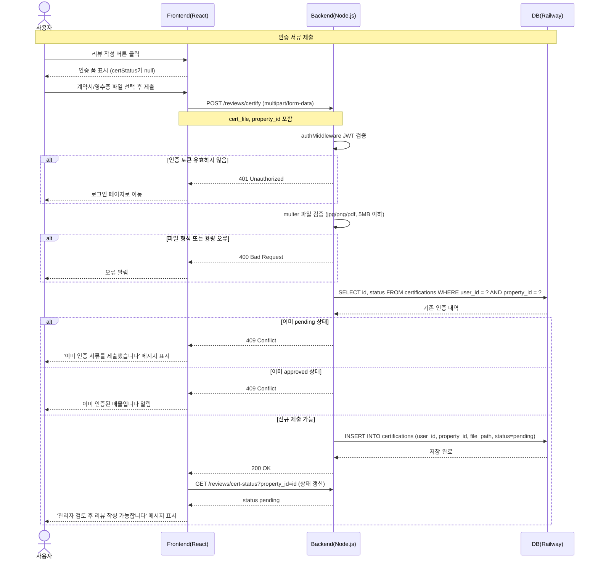
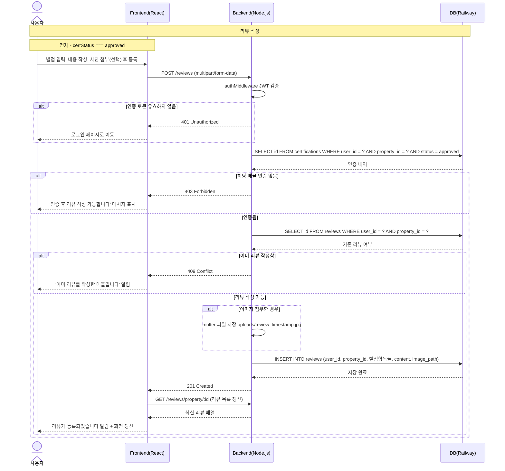
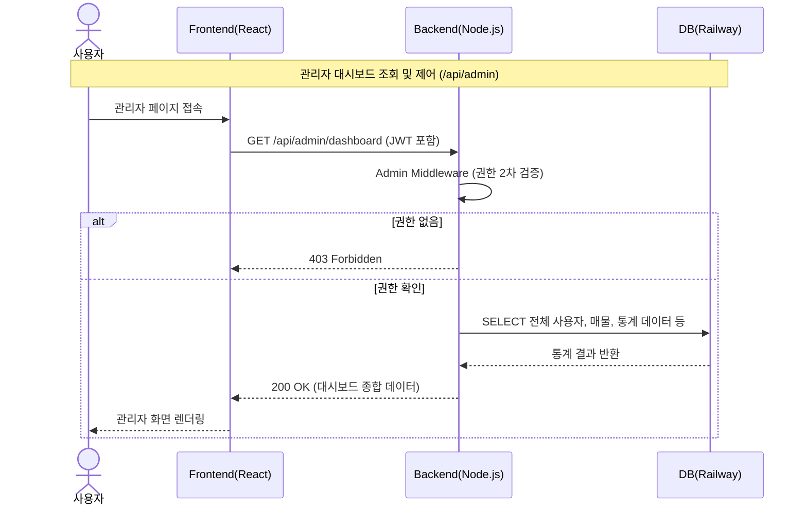

### 주요기능 시퀀스 다이어그램 
#### 1. 회원가입 및 이메일 인증

``` mermaid
sequenceDiagram
    actor U as 사용자
    participant F as Frontend(React)
    participant B as Backend(Node.js)
    participant D as DB(Railway)

    Note over U, D: 회원가입 (/api/auth/register)
    U->>F: 회원가입 버튼 클릭
    F->>F: 회원가입 페이지 렌더링
    U->>F: 닉네임, 이메일, 비밀번호 입력 후 제출
    F->>B: POST /api/register
    B->>D: SELECT 이메일 가입 여부 조회
    D-->>B: 쿼리 결과 반환

    alt 이미 가입된 이메일
        B-->>F: 409 Conflict
        F-->>U: '이미 사용 중인 이메일 입니다.' 메시지 표시 
    else 가입 가능한 이메일
        B->>B: 비밀번호 해싱 (bcrypt)
        B->>B: 인증 코드 및 만료 기간 생성
        B->>D: INSERT 유저 정보 저장
        B->>B: 인증 이메일 발송
        B-->>F: 201 Created
        F-->>U: '회원가입 완료! 인증 코드를 입력해주세요' 메시지 표시
    end

    Note over U, D : 이메일 인증 (/api/auth/verfi-email)
    U ->> F : 이메일 인증 번호 입력
    F ->> B : POST /api/verifi-email 호출
    B ->> D : SELECT 인증 코드 확인 및 유효기간 확인
    D -->> B : 쿼리 결과 반환

    alt 인증 실패 혹은 기간 만료
    B -->> F : 400 Bad Request
    F -->> U :  '인증 코드가 올바르지 않거나 만료되었습니다.' 메시지 표시
    else 인증 성공
    B ->> D : UPDATE 인증 성공 업데이트
    B -->> F : 200 OK 
    F -->> U : '이메일 인증이 완료되었습니다.' 메시지 표시
    end
```
#### 2. 로그인, 로그아웃

``` mermaid
sequenceDiagram
    actor U as 사용자
    participant F as Frontend(React)
    participant B as Backend(Node.js)
    participant D as DB(Railway)

    Note over U, D : 로그인(api/auth/login)
    U ->> F : 로그인 버튼 클릭
    F ->> F : 로그인 페이지 렌더링
    U ->> F : 이메일, 비밀번호 입력 후 제출
    F ->> B : POST /api/login 호출
    B ->> D : SELECT 유저 정보 검색
    D -->> B : 쿼리 결과 반환

    alt 이메일 혹은 비밀번호가 틀린 경우
    B -->> F : 401 Unauthorized 반환
    F -->> U : '이메일 또는 비밀번호가 틀렸습니다.' 메시지 표시

    else 이메일 인증이 되지 않은 경우
    B -->> F : 403 Forbidden 반환
    F -->> U : '이메일 인증이 필요합니다.' 메시지 표시

    else 로그인 성공
    B -->> F : 토큰 발급 (JWT)
    F ->> F: 토큰 LocalStorage에 저장
    F -->> U : 메인 페이지로 이동 
    end

    Note over U, D : 로그아웃 (api 없음)
    U ->> F : 로그아웃 버튼 클릭
    F ->> F : LocalStorage에서 발급된 토큰 삭제
    F -->> U : 메인페이지로 리다이렉트

```
#### 3. 매물 조회

``` mermaid
sequenceDiagram
actor U as 사용자
    participant F as Frontend(React)
    participant B as Backend(Node.js)
    participant D as DB(Railway)

    Note over U, D: 매물 조회 (Property Routes)
    
    %% 매물 상세 조회
    U ->> F : 지도에서 특정 매물 핀 클릭
    F ->> B : GET /api/property/:id 호출
    B ->> D : SELECT * FROM properties WHERE id = ?
    D -->> B : 매물 데이터 반환
    B -->> F : 200 OK (매물 상세 정보)
    F -->> U : 매물 상세 페이지 렌더링

```
#### 4. 실거래가 조회

``` mermaid
sequenceDiagram
actor U as 사용자
    participant F as Frontend(React)
    participant B as Backend(Node.js)
    participant D as DB(Railway)

    Note over U, D : 실거래가 조회(api/public-data/chart)
    U ->> F : 실거래가 조회 클릭
    F ->> F : 실거래가 조회 페이지 렌더링
    U ->> F : 동네, 유형, 거래 유형 입력
    F ->> B : GET api/public-data/chart 호출
    B ->> D : SELECT 사용자가 지정한 조건에 맞는 데이터 검색
    D -->> B : 쿼리 결과 반환
    B -->> F : 쿼리 결과 반환
    F ->> F : 반환된 정보 이용해 차트 생성
    F -->> U : 생성한 차트 표시

```
#### 5. 전세가율 계산

``` mermaid
sequenceDiagram
actor U as 사용자
    participant F as Frontend(React)
    participant B as Backend(Node.js)
    participant D as DB(Railway)

    Note over U, D : 전세가율 계산
    U ->> F : 메메가, 전세가 입력
    U ->> F : 전세가율 계산하기 버튼 클릭
    F ->> F : 전세가율 계산 후 반환

    alt 매가, 전새가 입력하지 않은 경우
    F -->> U : '올바른 금액을 입력해주세요.' 메시지 표시
    else 전세가율 80 % 이상
    F -->> U : '전세가율이 80% 이상입니다. 전세사기 위험이 높습니다. 계약 전 등기부등본을 반드시 확인하세요.' 메시지 표시
    else 전세가율 60% 이상
    F -->> U : '전세가율이 60~80% 수준입니다. 주의가 필요합니다. 근저당 설정 여부를 확인하세요.' 메시지 표시
    else 전세가율 60% 미만
    F -->> U : '전세가율이 60% 미만으로 비교적 안전합니다. 그래도 등기부등본 확인은 필수입니다.' 메시지 표시
    end

```
#### 6. 리뷰 등록 및 인증
- 인증

```mermaid
sequenceDiagram
    actor U as 사용자
    participant F as Frontend(React)
    participant B as Backend(Node.js)
    participant D as DB(Railway)

    Note over U,D: 인증 서류 제출 
    U->>F: 리뷰 작성 버튼 클릭
    F-->>U: 인증 폼 표시 (certStatus가 null)
    U->>F: 계약서/영수증 파일 선택 후 제출
    F->>B: POST /reviews/certify (multipart/form-data)
    Note over F,B: cert_file, property_id 포함
    B->>B: authMiddleware JWT 검증
    alt 인증 토큰 유효하지 않음
        B-->>F: 401 Unauthorized
        F-->>U: 로그인 페이지로 이동
    end
    B->>B: multer 파일 검증 (jpg/png/pdf, 5MB 이하)
    alt 파일 형식 또는 용량 오류
        B-->>F: 400 Bad Request
        F-->>U: 오류 알림
    end
    B->>D: SELECT id, status FROM certifications WHERE user_id = ? AND property_id = ?
    D-->>B: 기존 인증 내역
    alt 이미 pending 상태
        B-->>F: 409 Conflict
        F-->>U: '이미 인증 서류를 제출했습니다' 메시지 표시
    else 이미 approved 상태
        B-->>F: 409 Conflict
        F-->>U: 이미 인증된 매물입니다 알림
    else 신규 제출 가능
        B->>D: INSERT INTO certifications (user_id, property_id, file_path, status=pending)
        D-->>B: 저장 완료
        B-->>F: 200 OK
        F->>B: GET /reviews/cert-status?property_id=id (상태 갱신)
        B-->>F: status pending
        F-->>U: '관리자 검토 후 리뷰 작성 가능합니다' 메시지 표시
    end
```

- 리뷰

```mermaid
sequenceDiagram
    actor U as 사용자
    participant F as Frontend(React)
    participant B as Backend(Node.js)
    participant D as DB(Railway)

    Note over U,D: 리뷰 작성 
    Note over U,F: 전제 - certStatus === approved
    U->>F: 별점 입력, 내용 작성, 사진 첨부(선택) 후 등록
    F->>B: POST /reviews (multipart/form-data)
    B->>B: authMiddleware JWT 검증
    alt 인증 토큰 유효하지 않음
        B-->>F: 401 Unauthorized
        F-->>U: 로그인 페이지로 이동
    end
    B->>D: SELECT id FROM certifications WHERE user_id = ? AND property_id = ? AND status = approved
    D-->>B: 인증 내역
    alt 해당 매물 인증 없음
        B-->>F: 403 Forbidden
        F-->>U: '인증 후 리뷰 작성 가능합니다' 메시지 표시
    else 인증됨
        B->>D: SELECT id FROM reviews WHERE user_id = ? AND property_id = ?
        D-->>B: 기존 리뷰 여부
        alt 이미 리뷰 작성함
            B-->>F: 409 Conflict
            F-->>U: '이미 리뷰를 작성한 매물입니다' 알림
        else 리뷰 작성 가능
            alt 이미지 첨부한 경우
                B->>B: multer 파일 저장 uploads/review_timestamp.jpg
            end
            B->>D: INSERT INTO reviews (user_id, property_id, 별점항목들, content, image_path)
            D-->>B: 저장 완료
            B-->>F: 201 Created
            F->>B: GET /reviews/property/:id (리뷰 목록 갱신)
            B-->>F: 최신 리뷰 배열
            F-->>U: 리뷰가 등록되었습니다 알림 + 화면 갱신
        end
    end
```
#### 7. 관리자 기능

``` mermaid
sequenceDiagram
actor U as 사용자
    participant F as Frontend(React)
    participant B as Backend(Node.js)
    participant D as DB(Railway)

Note over U, D: 관리자 대시보드 조회 및 제어 (/api/admin)
    U->>F: 관리자 페이지 접속
    F->>B: GET /api/admin/dashboard (JWT 포함)
    B->>B: Admin Middleware (권한 2차 검증)
    
    alt 권한 없음
        B-->>F: 403 Forbidden
    else 권한 확인
        B->>D: SELECT 전체 사용자, 매물, 통계 데이터 등
        D-->>B: 통계 결과 반환
        B-->>F: 200 OK (대시보드 종합 데이터)
        F-->>U: 관리자 화면 렌더링
    end

```
